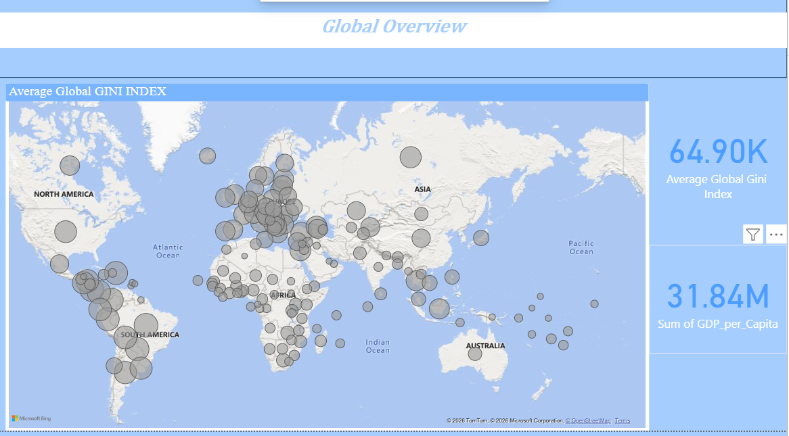
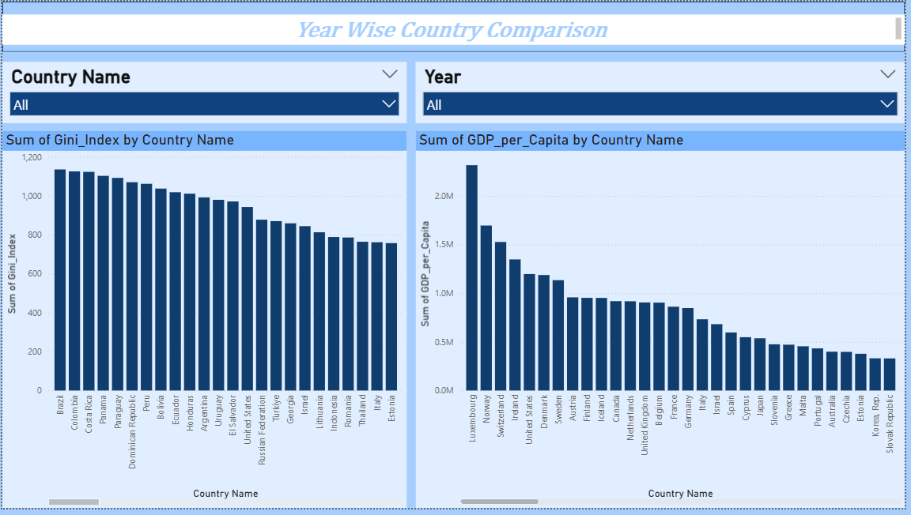
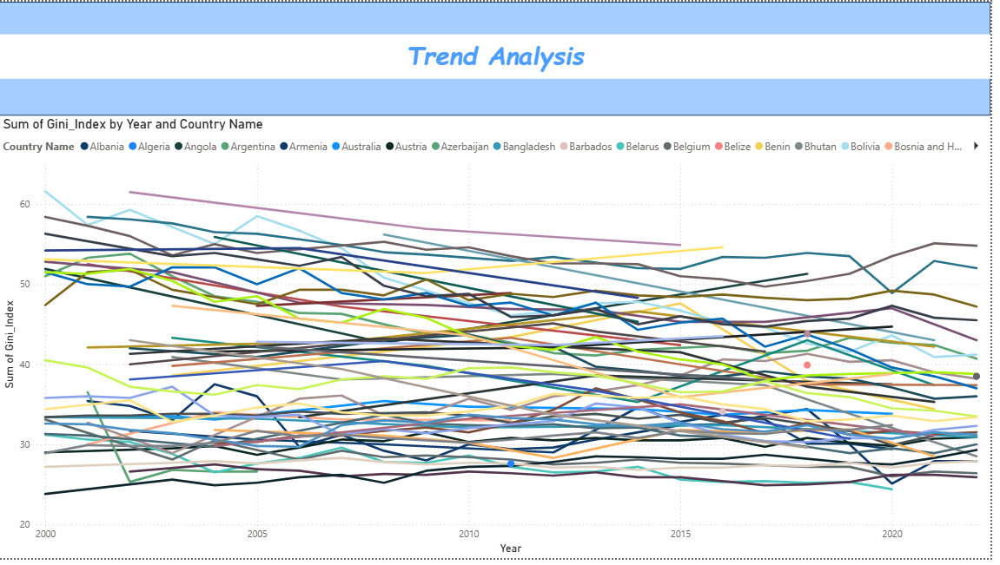

# 🌍 Global Income Analytics Dashboard

## 📌 Project Overview
This project analyzes global income inequality using:
- Gini Index
- GDP per capita
- Country-level trends

The project includes:
- Power BI Dashboard (3 pages)
- Streamlit Web App
- Data preprocessing using Python

---

## 🛠 Tools & Technologies
- Python (Pandas, NumPy)
- Power BI
- Streamlit
- Git & GitHub
- World Bank Data

---

## 📊 Power BI Dashboard Pages
1. Income Inequality Overview
2. Country-wise Comparison
3. Trends Analysis

---

## 🖼 Dashboard Screenshots

### Page 1 – Overview


### Page 2 – Comparison


### Page 3 – Trends


---

## 🚀 How to Run Streamlit App

```bash
cd streamlit
python -m streamlit run app.py
